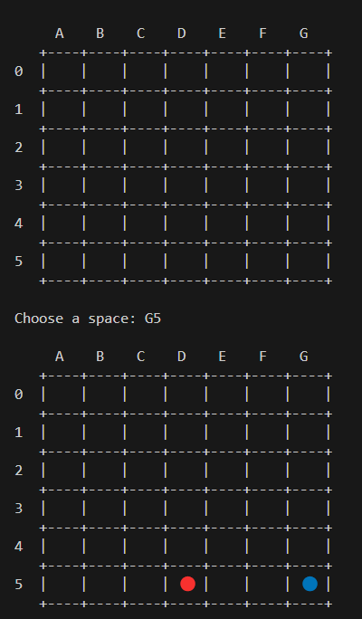

# 🔵🔴 Connect Four - Terminal Game

This is a python implementation of the classic Connect Four game for your terminal!

## Features
- **Classic Connect Four gameplay** in your terminal
- **Player vs Computer** mode with random AI
- **Colorful display** with emoji game pieces (🔴🔵)
- **Win detection** in all directions (horizontal, vertical, diagonal)
- **Realistic disc dropping** with gravity mechanics
- **Simple controls** with column letter + row number input

## 🎮 Installation
1. Have python 3.6+ installed
2. Clone or download this repository

## ▶️ How to Play
- Enter your move as LetterNumber (ex: A5)
- Columns: A-G (left to right)
- Rows: 0-5 (bottom to top)

## 📜 Game Rules
- **Players:**
    - User (🔵) vs Computer (🔴)
- **Objective:** Be the first to connect 4 🔵 tokens
- **Winning Conditions:**
    - Horizontal(—)
    - Vertical (|)
    - Diagonal (╲ or ╱)